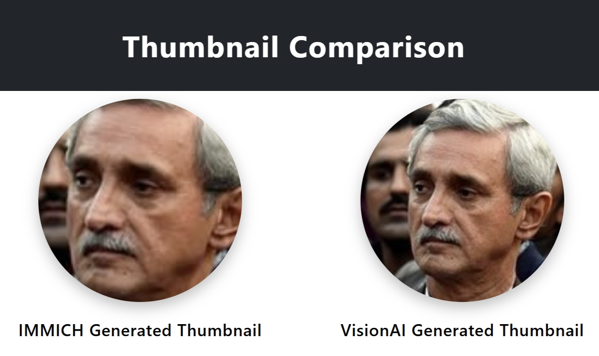

| Feature / Component               | Immich                                                                                          | VisionAI                                                                                      |
|----------------------------------|------------------------------------------------------------------------------------------------|------------------------------------------------------------------------------------------------|
| **Model for Detection**           | `InsightFace` | `RetinaFace` |
| **Cropping**  | Tight Crop. | Margin based croping. |
| **Model for Embedding Generation**| **ArcFaceONNX** | **FaceNet** (via `keras_facenet`)  |
| **Model for Clustering**          | Usually DBSCAN on embeddings | **DBSCAN** clustering and reclustering with `cosine_similarity` and DBSCAN, optionally with UMAP dimensionality reduction.   |
| **Handling Outliers**             | Faces below `min_score = 0.7` or embeddings not assigned remain unclustered until further processing. | Faces below similarity threshold `(0.75)` remain unassigned until DBSCAN clustering.                   |
| **Acceleration / Hardware Support**| InsightFace session (CUDA, OpenVINO, CPU).     | TensorFlow GPU/CPU; memory growth enabled for GPU.                                           |
| **Embedding Storage / DB**        | Embeddings serialized (`serialize_np_array`) and stored externally (e.g., DB or vector store). | Embeddings stored in database (varbinary or JSON). Used for clustering and recognition.      |
| **Additional Features**           | No portrait generation | Portrait generation (medoid + sharpness) |
