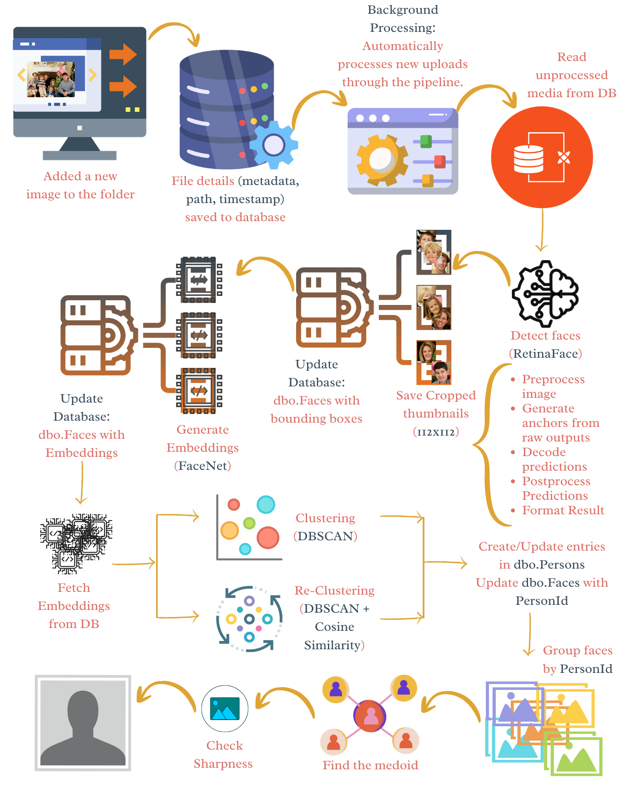

# Face Recognition System

The **Face Recognition System** is designed to provide an end-to-end solution for managing and identifying faces across large collections of images and media files. It combines modern deep learning models with robust database integration, offering both accuracy and scalability. 

At its core, the system leverages **RetinaFace** for face detection and **FaceNet** for generating unique face embeddings. These embeddings are then clustered using **UMAP** for dimensionality reduction and **DBSCAN** for unsupervised grouping, making it possible to automatically discover and organize individuals in media datasets. For incremental recognition, the system applies **cosine similarity** to match new faces against already known persons.



### Key Highlights
- Seamless integration with SQL Server for storing faces, persons, and metadata.  
- Automated and manual execution modes, suitable for both small-scale testing and continuous monitoring.  
- A reclustering mechanism that improves accuracy by refining person assignments as more data becomes available.  
- A clear logging and auditing trail to support monitoring, debugging, and traceability.  

With its modular pipeline and configurable architecture, the Face Recognition System can be adapted for diverse use cases including digital asset management, security monitoring, media analysis, and research.

## Python Libraries

| Category | Library | Purpose |
|----------|---------|---------|
| Core & Utilities | `argparse` | Command-line argument parsing |
|  | `os` | File handling and path operations |
|  | `sys` | System utilities |
|  | `shutil` | File operations (copy, move, delete) |
|  | `re` | Regular expressions |
|  | `posixpath` | Cross-platform path handling |
|  | `time` | Timing, delays, countdowns |
|  | `datetime` | Timestamp handling |
|  | `json` | JSON serialization and parsing |
|  | `logging` | Logging system events |
|  | `collections` | Specialized data structures (e.g., defaultdict) |
| Environment & Database | `python-dotenv` | Load environment variables from `.env` files |
|  | `pyodbc` | Connect and interact with Microsoft SQL Server |
| Image Processing | `opencv-python` (`cv2`) | Image I/O, manipulation, cropping, resizing |
|  | `numpy` | Numerical computations, arrays |
|  | `pandas` | Tabular data handling |
|  | `openpyxl` | Excel I/O |
|  | `matplotlib.pyplot` | Visualize embeddings or clusters in Colab |
|  | `math` | Mathematical operations |
| Face Detection & Recognition | `retina-face` | Face detection and bounding boxes |
|  | `keras-facenet` | Extract face embeddings using FaceNet |
| Clustering & ML | `scikit-learn` | DBSCAN clustering, cosine similarity |
|  | `umap-learn` | Dimensionality reduction for embeddings |
|  | `cosine_similarity` (from `sklearn.metrics.pairwise`) | Compute similarity between embeddings |
|  | `onnxruntime` | Optimized model inference |
| Reporting & Visualization | `tabulate` | Nicely formatted tables in console and log files |
| Google Colab | `google.colab.patches` | `cv2_imshow` for displaying images in Colab |

## Project Structure
```bash
deepframe-backend-main/                            # Root project folder
├── DemoVideos/                                    # Demo showcase videos
│   ├── Automated_Face_Recognition_System_with_Re_Clustering.mp4
│   ├── Detection and Recognition Pipeline.mp4
│   ├── Face Detection.mp4
│   └── README.md                                  # Notes about demo videos
├── Docs/                                          # Documentation
│   ├── Face_Recognition_System_Manual.pdf         # User manual
│   ├── immich_face_flow.svg                       # System architecture diagram
│   └── immich_face_recognition.md                 # Technical docs
├── README.md                                      # Project overview
└── services/                                      # Backend services
    └── image_grouping/                            # Face recognition pipeline service
        ├── .env                                   # Environment configs (local dev)
        ├── FaceRecognitionSystem.png              # System diagram
        ├── Notebooks/                             # Jupyter notebooks
        │   ├── Face_Recognition_System_(FRS).ipynb
        │   ├── README.md
        │   └── face-recognition-system-frs.pdf
        ├── README.md
        ├── config.py                              # Database & app configuration
        ├── docker/                                # Docker setup for deployment
        │   ├── .env.example
        │   ├── Dockerfile
        │   ├── README.md
        │   ├── docker-entrypoint.sh
        │   ├── healthcheck.py
        │   ├── requirements.txt
        │   └── requirements_locked.txt
        ├── docker-compose.yml                     # Docker services orchestration
        ├── image_face_detection/                  # Face detection module
        │   ├── Images/                            # Raw images for testing
        │   │   ├── GroupM.jpg … wedding.jpg       # (multiple test images)
        │   ├── Thumbnails/                        # Face thumbnails
        │   │   ├── conference_TN1.jpg … news_TN.jpg
        │   ├── Thumbnails.jpeg
        │   ├── detect_faces.py                    # Face detection & cropping
        │   ├── logger_config.py                   # Logging setup
        │   └── README.md
        ├── main.py                                # CLI entry point
        ├── person_recognition/                    # Person recognition module
        │   ├── recognize_persons.py               # Embedding + clustering logic
        │   ├── logger_config.py                   # Logging setup
        │   ├── README.md
        │   └── sql/                               # Recognition SQL scripts
        │       ├── link_tables.sql
        │       ├── upsert_person.sql
        │       └── README.md
        ├── requirements.txt                       # Python dependencies
        ├── sample_images/                         # Sample input images
        │   ├── conference.jpg
        │   ├── interview.jpg
        │   ├── news.jpg
        │   └── README.md
        └── sql/                                   # Database schema & scripts
            ├── Portrait.sql
            ├── aditionals.sql
            ├── clusters_display.sql
            ├── create_database&tables.sql
            ├── delete.sql
            ├── sample_insert_script.sql
            ├── show_tables.sql
            └── README.md

```

## Setup and Installation
### Installation

1. Clone the repository:

```bash
git clone https://github.com/DeepFrame/deepframe-backend.git
cd deepframe-backend/services/image_grouping
```

2. Install dependencies (recommended to use a virtual environment with Python v3.8.20):

```bash
pip install -r requirements.txt
```

3. Configure your database connection in `.env`:

```python
SQL_CONNECTION_STRING = "DRIVER={SQL Server};SERVER=your_server;DATABASE=your_db;UID=user;PWD=password"
```

4. Ensure your database contains the required tables with required fields:

* dbo.MediaFile

| Column Name | Data Type | Required | Notes |
|-------------|-----------|----------|-------|
| Id | INT (PK, Identity) | Yes | Primary key |
| FilePath | NVARCHAR(500) | Yes | Path to media file |
| FileName | NVARCHAR(255) | Yes | File name |
| Extensions | NVARCHAR(10) | No | File extension |
| CreatedAt | DATETIME2 | Yes | Default: `SYSDATETIME()` |
| ModifiedAt | DATETIME2 | No | Last modified timestamp |

---

* dbo.MediaItems

| Column Name | Data Type | Required | Notes |
|-------------|-----------|----------|-------|
| Id | INT (PK, Identity) | Yes | Primary key |
| MediaFileId | INT (FK → MediaFile.Id) | Yes | Reference to media file |
| Name | NVARCHAR(255) | Yes | Media item name |
| IsFacesExtracted | BIT | Yes | Default: `0` |
| FacesExtractedOn | DATETIME2 | No | Timestamp when faces extracted |

---

* dbo.Persons

| Column Name | Data Type | Required | Notes |
|-------------|-----------|----------|-------|
| Id | INT (PK, Identity) | Yes | Primary key |
| PortraitMediaFileId | INT (FK → MediaFile.Id) | No | Portrait file reference |
| Name | NVARCHAR(255) | No | Person name |
| Rank | NVARCHAR(50) | No | Rank |
| Appointment | NVARCHAR(100) | No | Appointment |
| CreatedAt | DATETIME2 | Yes | Default: `SYSDATETIME()` |
| ModifiedAt | DATETIME2 | No | Last modified timestamp |

---

* dbo.Faces

| Column Name | Data Type | Required | Notes |
|-------------|-----------|----------|-------|
| Id | INT (PK, Identity) | Yes | Primary key |
| MediaItemId | INT (FK → MediaItems.Id) | Yes | Reference to media item |
| PersonId | INT (FK → Persons.Id) | No | Linked person |
| BoundingBox | NVARCHAR(255) | No | Face bounding box |
| Embedding | VARBINARY(MAX) | No | Face embedding vector |
| FrameNumber | INT | No | Frame number (if from video) |
| Name | NVARCHAR(255) | No | Optional name/label |
| CreatedAt | DATETIME2 | Yes | Default: `SYSDATETIME()` |
| ModifiedAt | DATETIME2 | No | Last modified timestamp |


### Usage

The main CLI is `main.py`, supporting multiple modes:

```bash
python main.py [options]
```

#### Options

| Option                | Description                                                          |
| --------------------- | -------------------------------------------------------------------- |
| `--test <image_path>` | Run face detection on a single image.                                |
| `--db`                | Run face detection on all database media items once.                 |
| `--watch`             | Continuously monitor and process new media items.                    |
| `--recognize`         | Generate embeddings and cluster detected faces.                      |
| `--all`               | Run full pipeline: detection → recognition once.                     |
| `--automate`          | Run full pipeline every 3 minutes.                                   |
| `--recluster`         | Rebuild clusters for unmatched faces by comparing with existing persons and with each other. |

