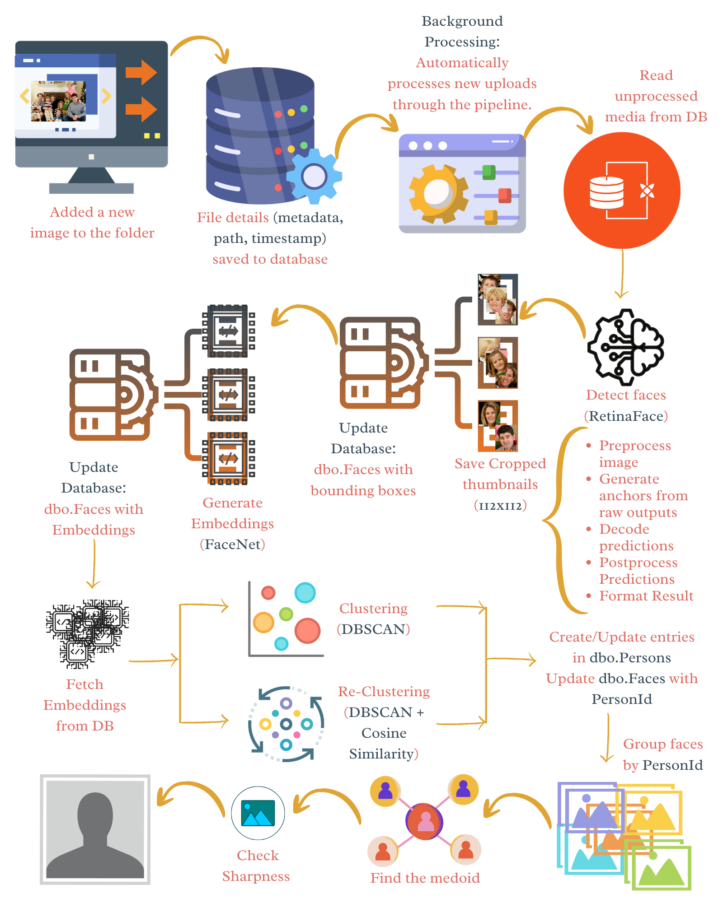

Here’s a polished `README.md` tailored for your GitHub project, highlighting the purpose, installation, usage, and structure of your face recognition system:

---

# Face Recognition System

This repository provides a **face detection and recognition pipeline** that integrates detection, embedding generation, and clustering of faces. It supports single-image testing, batch processing from a database, continuous monitoring, and automated pipelines for recurring processing.



## Features

* **Face Detection:** Detect faces in images or media items stored in a database.
* **Face Recognition:** Generate embeddings for detected faces and cluster them into distinct persons.
* **Automated Pipelines:** Run full detection and recognition periodically.
* **Reclustering:** Recompute clusters for unassigned faces by comparing them against each other or matching them with previously assigned persons.

## Installation

1. Clone the repository:

```bash
git clone https://github.com/DeepFrame/deepframe-backend.git
cd deepframe-backend/services/image_grouping
```

2. Install dependencies (recommended to use a virtual environment with Python v3.8.20):

```bash
pip install -r requirements.txt
```

3. Configure your database connection in `image_face_detection/config.py`:

```python
SQL_CONNECTION_STRING = "DRIVER={SQL Server};SERVER=your_server;DATABASE=your_db;UID=user;PWD=password"
```

4. Ensure your database contains the required tables with required fields:

* `MediaFile`
* `MediaItems`
* `Faces`
* `Persons`

## Usage

The main CLI is `main.py`, supporting multiple modes:

```bash
python main.py [options]
```

### Options

| Option                | Description                                                          |
| --------------------- | -------------------------------------------------------------------- |
| `--test <image_path>` | Run face detection on a single image.                                |
| `--db`                | Run face detection on all database media items once.                 |
| `--watch`             | Continuously monitor and process new media items.                    |
| `--recognize`         | Generate embeddings and cluster detected faces.                      |
| `--all`               | Run full pipeline: detection → recognition once.                     |
| `--automate`          | Run full pipeline every 3 minutes.                                   |
| `--recluster`         | Rebuild clusters for all faces, ignoring existing PersonId mappings. |

### Examples

1. **Test a single image:**

```bash
python main.py --test path/to/image.jpg
```

2. **Process all database media items:**

```bash
python main.py --db
```

3. **Run full pipeline once:**

```bash
python main.py --all
```

4. **Run automated pipeline every 3 minutes:**

```bash
python main.py --automate
```

5. **Recluster all faces:**

```bash
python main.py --recluster
```

## Project Structure

```
.
├── main.py                     # Entry point for CLI
├── image_face_detection/       # Face detection module
│   ├── detect_faces.py         # Face Detection, Cropping and Save thumbnails logic
│   └── config.py               # Database connection
│   └── logger_config.py        # Logs Configuration
│   └── logs/                   # Logs for detection
├── person_recognition          # Face Recognition Module
│   ├── recognize_persons.py    # Face embedding and clustering logic
│   └── logger_config.py        # Logs Configuration
│   └── logs/                   # Logs for embeddings and clustering 
├── requirements.txt
└── README.md
```

## Logging

* Logs are stored in `logs/embeddings_clustering.log`.
   - Provides detailed info about embeddings generation and clustering.
* Logs are stored in `logs/face_detection.log`.
   - Provides detailed info details of the face-detection pipeline, including processed images, detected faces, database updates, and any errors or warnings.

## Notes

* **FaceNet** is used for embedding generation.
* **DBSCAN + UMAP** is used for clustering embeddings.
* **Cosine Similarity** assigns unlabelled faces to known persons if similarity ≥ 0.8.
* Ensure images are accessible and bounding boxes are valid for proper embedding generation.
* Reclustering is optional but recommended when significant new faces are added.

---
